# Laravel Blog Demo Api

📸 [Jump to Screenshots](#screenshots)

## Project Structure

* 📁 [app](./app)
  * 📁 [Enums](./app/Enums)
    * 📄 [UserRole.php](./app/Enums/UserRole.php)
  * 📁 [Events](./app/Events)
    * 📄 [PostPublished.php](./app/Events/PostPublished.php)
  * 📁 [Exceptions](./app/Exceptions)
    * 📄 [MySuperException.php](./app/Exceptions/MySuperException.php)
  * 📁 [Filament](./app/Filament)
    * 📁 [Resources](./app/Filament/Resources)
      * 📁 [CommentResource](./app/Filament/Resources/CommentResource)
        * 📁 [Pages](./app/Filament/Resources/CommentResource/Pages)
          * 📄 [CreateComment.php](./app/Filament/Resources/CommentResource/Pages/CreateComment.php)
          * 📄 [EditComment.php](./app/Filament/Resources/CommentResource/Pages/EditComment.php)
          * 📄 [ListComments.php](./app/Filament/Resources/CommentResource/Pages/ListComments.php)
      * 📁 [LikeResource](./app/Filament/Resources/LikeResource)
        * 📁 [Pages](./app/Filament/Resources/LikeResource/Pages)
          * 📄 [CreateLike.php](./app/Filament/Resources/LikeResource/Pages/CreateLike.php)
          * 📄 [EditLike.php](./app/Filament/Resources/LikeResource/Pages/EditLike.php)
          * 📄 [ListLikes.php](./app/Filament/Resources/LikeResource/Pages/ListLikes.php)
      * 📁 [PostResource](./app/Filament/Resources/PostResource)
        * 📁 [Pages](./app/Filament/Resources/PostResource/Pages)
          * 📄 [CreatePost.php](./app/Filament/Resources/PostResource/Pages/CreatePost.php)
          * 📄 [EditPost.php](./app/Filament/Resources/PostResource/Pages/EditPost.php)
          * 📄 [ListPosts.php](./app/Filament/Resources/PostResource/Pages/ListPosts.php)
      * 📁 [TagResource](./app/Filament/Resources/TagResource)
        * 📁 [Pages](./app/Filament/Resources/TagResource/Pages)
          * 📄 [CreateTag.php](./app/Filament/Resources/TagResource/Pages/CreateTag.php)
          * 📄 [EditTag.php](./app/Filament/Resources/TagResource/Pages/EditTag.php)
          * 📄 [ListTags.php](./app/Filament/Resources/TagResource/Pages/ListTags.php)
      * 📁 [UserResource](./app/Filament/Resources/UserResource)
        * 📁 [Pages](./app/Filament/Resources/UserResource/Pages)
          * 📄 [CreateUser.php](./app/Filament/Resources/UserResource/Pages/CreateUser.php)
          * 📄 [EditUser.php](./app/Filament/Resources/UserResource/Pages/EditUser.php)
          * 📄 [ListUsers.php](./app/Filament/Resources/UserResource/Pages/ListUsers.php)
      * 📄 [CommentResource.php](./app/Filament/Resources/CommentResource.php)
      * 📄 [LikeResource.php](./app/Filament/Resources/LikeResource.php)
      * 📄 [PostResource.php](./app/Filament/Resources/PostResource.php)
      * 📄 [TagResource.php](./app/Filament/Resources/TagResource.php)
      * 📄 [UserResource.php](./app/Filament/Resources/UserResource.php)
  * 📁 [Http](./app/Http)
    * 📁 [Controllers](./app/Http/Controllers)
      * 📁 [Api](./app/Http/Controllers/Api)
        * 📄 [PostController.php](./app/Http/Controllers/Api/PostController.php)
      * 📄 [CommentController.php](./app/Http/Controllers/CommentController.php)
      * 📄 [Controller.php](./app/Http/Controllers/Controller.php)
      * 📄 [LikeController.php](./app/Http/Controllers/LikeController.php)
      * 📄 [PostController.php](./app/Http/Controllers/PostController.php)
      * 📄 [TagController.php](./app/Http/Controllers/TagController.php)
    * 📁 [Requests](./app/Http/Requests)
      * 📄 [StoreCommentRequest.php](./app/Http/Requests/StoreCommentRequest.php)
      * 📄 [StoreLikeRequest.php](./app/Http/Requests/StoreLikeRequest.php)
      * 📄 [StorePostRequest.php](./app/Http/Requests/StorePostRequest.php)
      * 📄 [StoreSuperPostRequest.php](./app/Http/Requests/StoreSuperPostRequest.php)
      * 📄 [StoreTagRequest.php](./app/Http/Requests/StoreTagRequest.php)
      * 📄 [UpdateCommentRequest.php](./app/Http/Requests/UpdateCommentRequest.php)
      * 📄 [UpdateLikeRequest.php](./app/Http/Requests/UpdateLikeRequest.php)
      * 📄 [UpdatePostRequest.php](./app/Http/Requests/UpdatePostRequest.php)
      * 📄 [UpdateTagRequest.php](./app/Http/Requests/UpdateTagRequest.php)
    * 📁 [Resources](./app/Http/Resources)
      * 📄 [PostResource.php](./app/Http/Resources/PostResource.php)
      * 📄 [UserResource.php](./app/Http/Resources/UserResource.php)
  * 📁 [Listeners](./app/Listeners)
    * 📄 [SendPostPublishedNotification.php](./app/Listeners/SendPostPublishedNotification.php)
  * 📁 [Mail](./app/Mail)
    * 📄 [PostPublished.php](./app/Mail/PostPublished.php)
  * 📁 [Models](./app/Models)
    * 📄 [Comment.php](./app/Models/Comment.php)
    * 📄 [Like.php](./app/Models/Like.php)
    * 📄 [Post.php](./app/Models/Post.php)
    * 📄 [Tag.php](./app/Models/Tag.php)
    * 📄 [User.php](./app/Models/User.php)
  * 📁 [Notifications](./app/Notifications)
    * 📄 [NewPostNotification.php](./app/Notifications/NewPostNotification.php)
  * 📁 [Observers](./app/Observers)
    * 📄 [PostObserver.php](./app/Observers/PostObserver.php)
  * 📁 [Policies](./app/Policies)
    * 📄 [CommentPolicy.php](./app/Policies/CommentPolicy.php)
    * 📄 [LikePolicy.php](./app/Policies/LikePolicy.php)
    * 📄 [PostPolicy.php](./app/Policies/PostPolicy.php)
    * 📄 [TagPolicy.php](./app/Policies/TagPolicy.php)
  * 📁 [Providers](./app/Providers)
    * 📁 [Filament](./app/Providers/Filament)
      * 📄 [AdminPanelProvider.php](./app/Providers/Filament/AdminPanelProvider.php)
    * 📄 [AppServiceProvider.php](./app/Providers/AppServiceProvider.php)
* 📁 [bootstrap](./bootstrap)
* 📁 [config](./config)
* 📁 [database](./database)
  * 📁 [factories](./database/factories)
    * 📄 [CommentFactory.php](./database/factories/CommentFactory.php)
    * 📄 [LikeFactory.php](./database/factories/LikeFactory.php)
    * 📄 [PostFactory.php](./database/factories/PostFactory.php)
    * 📄 [TagFactory.php](./database/factories/TagFactory.php)
    * 📄 [UserFactory.php](./database/factories/UserFactory.php)
  * 📁 [migrations](./database/migrations)
    * 📄 [0001_01_01_000000_create_users_table.php](./database/migrations/0001_01_01_000000_create_users_table.php)
    * 📄 [0001_01_01_000001_create_cache_table.php](./database/migrations/0001_01_01_000001_create_cache_table.php)
    * 📄 [0001_01_01_000002_create_jobs_table.php](./database/migrations/0001_01_01_000002_create_jobs_table.php)
    * 📄 [2025_03_03_150339_change_users_table.php](./database/migrations/2025_03_03_150339_change_users_table.php)
    * 📄 [2025_03_03_151354_create_tags_table.php](./database/migrations/2025_03_03_151354_create_tags_table.php)
    * 📄 [2025_03_03_152041_create_posts_table.php](./database/migrations/2025_03_03_152041_create_posts_table.php)
    * 📄 [2025_03_03_153650_create_comments_table.php](./database/migrations/2025_03_03_153650_create_comments_table.php)
    * 📄 [2025_03_03_154050_create_likes_table.php](./database/migrations/2025_03_03_154050_create_likes_table.php)
    * 📄 [2025_03_03_154331_create_post_tag_table.php](./database/migrations/2025_03_03_154331_create_post_tag_table.php)
    * 📄 [2025_03_03_163230_create_personal_access_tokens_table.php](./database/migrations/2025_03_03_163230_create_personal_access_tokens_table.php)
    * 📄 [2025_03_10_170652_create_notifications_table.php](./database/migrations/2025_03_10_170652_create_notifications_table.php)
  * 📁 [seeders](./database/seeders)
    * 📄 [CommentSeeder.php](./database/seeders/CommentSeeder.php)
    * 📄 [DatabaseSeeder.php](./database/seeders/DatabaseSeeder.php)
    * 📄 [LikeSeeder.php](./database/seeders/LikeSeeder.php)
    * 📄 [PostSeeder.php](./database/seeders/PostSeeder.php)
    * 📄 [TagSeeder.php](./database/seeders/TagSeeder.php)
    * 📄 [UserSeeder.php](./database/seeders/UserSeeder.php)
* 📁 [lang](./lang)
  * 📁 [en](./lang/en)
    * 📄 [auth.php](./lang/en/auth.php)
    * 📄 [pagination.php](./lang/en/pagination.php)
    * 📄 [passwords.php](./lang/en/passwords.php)
    * 📄 [validation.php](./lang/en/validation.php)
  * 📁 [uk](./lang/uk)
    * 📄 [actions.php](./lang/uk/actions.php)
    * 📄 [auth.php](./lang/uk/auth.php)
    * 📄 [http-statuses.php](./lang/uk/http-statuses.php)
    * 📄 [pagination.php](./lang/uk/pagination.php)
    * 📄 [passwords.php](./lang/uk/passwords.php)
    * 📄 [validation.php](./lang/uk/validation.php)
  * 📄 [uk.json](./lang/uk.json)
* 📁 [public](./public)
  * 📁 [css](./public/css)
    * 📁 [filament](./public/css/filament)
      * 📁 [filament](./public/css/filament/filament)
        * 📄 [app.css](./public/css/filament/filament/app.css)
      * 📁 [forms](./public/css/filament/forms)
        * 📄 [forms.css](./public/css/filament/forms/forms.css)
      * 📁 [support](./public/css/filament/support)
        * 📄 [support.css](./public/css/filament/support/support.css)
  * 📁 [js](./public/js)
    * 📁 [filament](./public/js/filament)
      * 📁 [filament](./public/js/filament/filament)
        * 📄 [app.js](./public/js/filament/filament/app.js)
        * 📄 [echo.js](./public/js/filament/filament/echo.js)
      * 📁 [forms](./public/js/filament/forms)
        * 📁 [components](./public/js/filament/forms/components)
          * 📄 [color-picker.js](./public/js/filament/forms/components/color-picker.js)
          * 📄 [date-time-picker.js](./public/js/filament/forms/components/date-time-picker.js)
          * 📄 [file-upload.js](./public/js/filament/forms/components/file-upload.js)
          * 📄 [key-value.js](./public/js/filament/forms/components/key-value.js)
          * 📄 [markdown-editor.js](./public/js/filament/forms/components/markdown-editor.js)
          * 📄 [rich-editor.js](./public/js/filament/forms/components/rich-editor.js)
          * 📄 [select.js](./public/js/filament/forms/components/select.js)
          * 📄 [tags-input.js](./public/js/filament/forms/components/tags-input.js)
          * 📄 [textarea.js](./public/js/filament/forms/components/textarea.js)
      * 📁 [notifications](./public/js/filament/notifications)
        * 📄 [notifications.js](./public/js/filament/notifications/notifications.js)
      * 📁 [support](./public/js/filament/support)
        * 📄 [support.js](./public/js/filament/support/support.js)
      * 📁 [tables](./public/js/filament/tables)
        * 📁 [components](./public/js/filament/tables/components)
          * 📄 [table.js](./public/js/filament/tables/components/table.js)
      * 📁 [widgets](./public/js/filament/widgets)
        * 📁 [components](./public/js/filament/widgets/components)
          * 📁 [stats-overview](./public/js/filament/widgets/components/stats-overview)
            * 📁 [stat](./public/js/filament/widgets/components/stats-overview/stat)
              * 📄 [chart.js](./public/js/filament/widgets/components/stats-overview/stat/chart.js)
          * 📄 [chart.js](./public/js/filament/widgets/components/chart.js)
  * 📄 [index.php](./public/index.php)
* 📁 [resources](./resources)
  * 📁 [css](./resources/css)
    * 📄 [app.css](./resources/css/app.css)
  * 📁 [js](./resources/js)
    * 📄 [app.js](./resources/js/app.js)
    * 📄 [bootstrap.js](./resources/js/bootstrap.js)
  * 📁 [views](./resources/views)
    * 📁 [components](./resources/views/components)
      * 📁 [posts](./resources/views/components/posts)
        * 📄 [card.blade.php](./resources/views/components/posts/card.blade.php)
      * 📄 [alert.blade.php](./resources/views/components/alert.blade.php)
      * 📄 [footer.blade.php](./resources/views/components/footer.blade.php)
      * 📄 [layout.blade.php](./resources/views/components/layout.blade.php)
      * 📄 [navbar.blade.php](./resources/views/components/navbar.blade.php)
    * 📁 [errors](./resources/views/errors)
      * 📄 [401.blade.php](./resources/views/errors/401.blade.php)
      * 📄 [402.blade.php](./resources/views/errors/402.blade.php)
      * 📄 [403.blade.php](./resources/views/errors/403.blade.php)
      * 📄 [404.blade.php](./resources/views/errors/404.blade.php)
      * 📄 [419.blade.php](./resources/views/errors/419.blade.php)
      * 📄 [429.blade.php](./resources/views/errors/429.blade.php)
      * 📄 [500.blade.php](./resources/views/errors/500.blade.php)
      * 📄 [503.blade.php](./resources/views/errors/503.blade.php)
      * 📄 [layout.blade.php](./resources/views/errors/layout.blade.php)
      * 📄 [minimal.blade.php](./resources/views/errors/minimal.blade.php)
      * 📄 [my-super-ex.blade.php](./resources/views/errors/my-super-ex.blade.php)
    * 📁 [mail](./resources/views/mail)
      * 📁 [posts](./resources/views/mail/posts)
        * 📄 [published-markdown.blade.php](./resources/views/mail/posts/published-markdown.blade.php)
        * 📄 [published.blade.php](./resources/views/mail/posts/published.blade.php)
    * 📁 [posts](./resources/views/posts)
      * 📄 [create.blade.php](./resources/views/posts/create.blade.php)
      * 📄 [edit.blade.php](./resources/views/posts/edit.blade.php)
      * 📄 [index.blade.php](./resources/views/posts/index.blade.php)
      * 📄 [show.blade.php](./resources/views/posts/show.blade.php)
    * 📄 [welcome.blade.php](./resources/views/welcome.blade.php)
* 📁 [routes](./routes)
  * 📄 [api.php](./routes/api.php)
  * 📄 [console.php](./routes/console.php)
  * 📄 [web.php](./routes/web.php)
* 📁 [screenshots](./screenshots)
* 📄 [_ide_helper.php](./_ide_helper.php)
* 📄 [_ide_helper_models.php](./_ide_helper_models.php)
* 📄 [composer.json](./composer.json)
* 📄 [package.json](./package.json)
## Screenshots

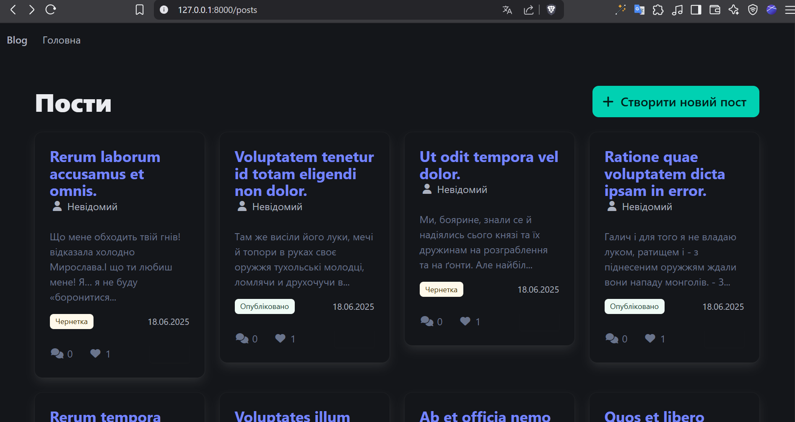

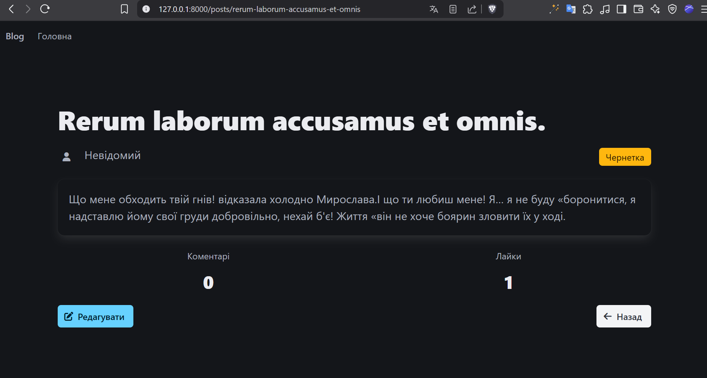

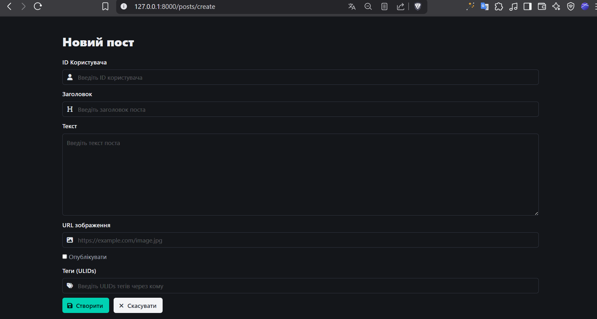

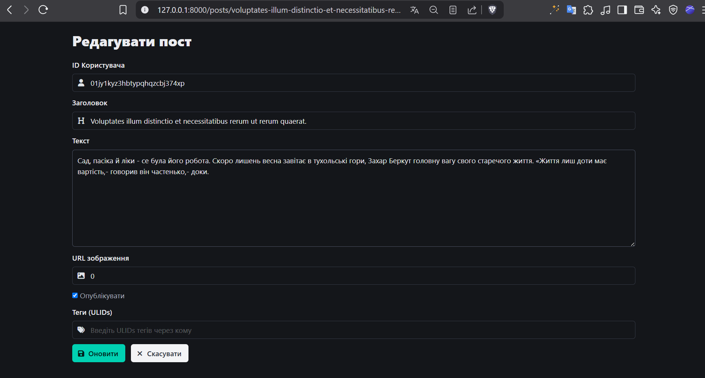

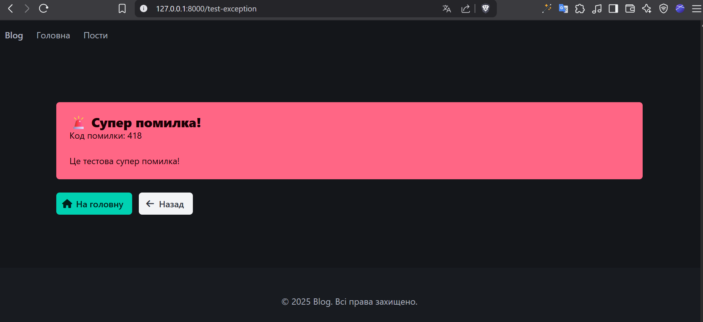

## 🔥 Filament Admin Panel

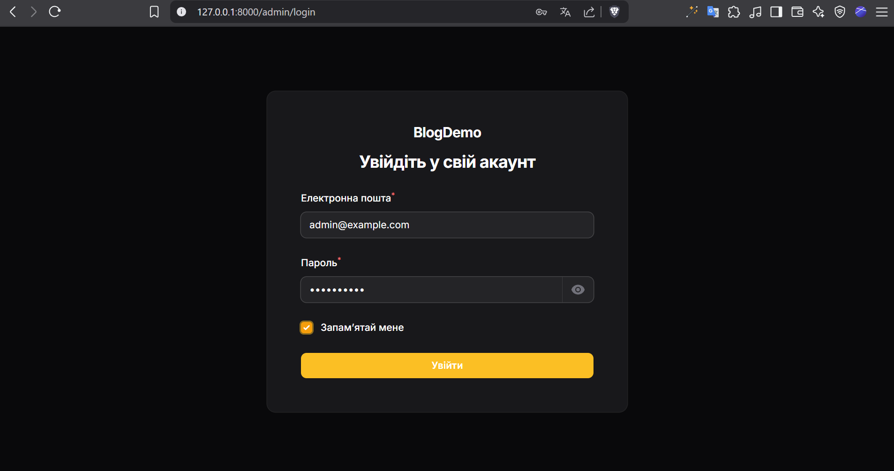

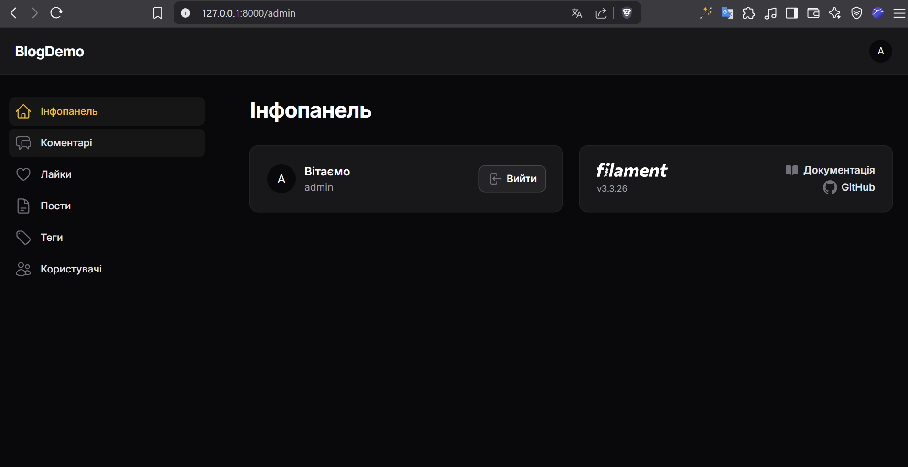

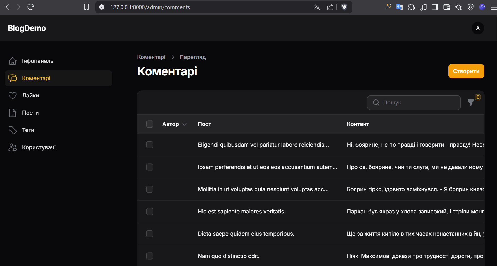

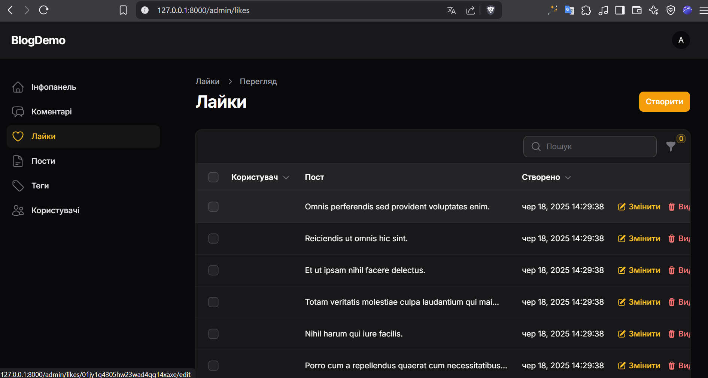

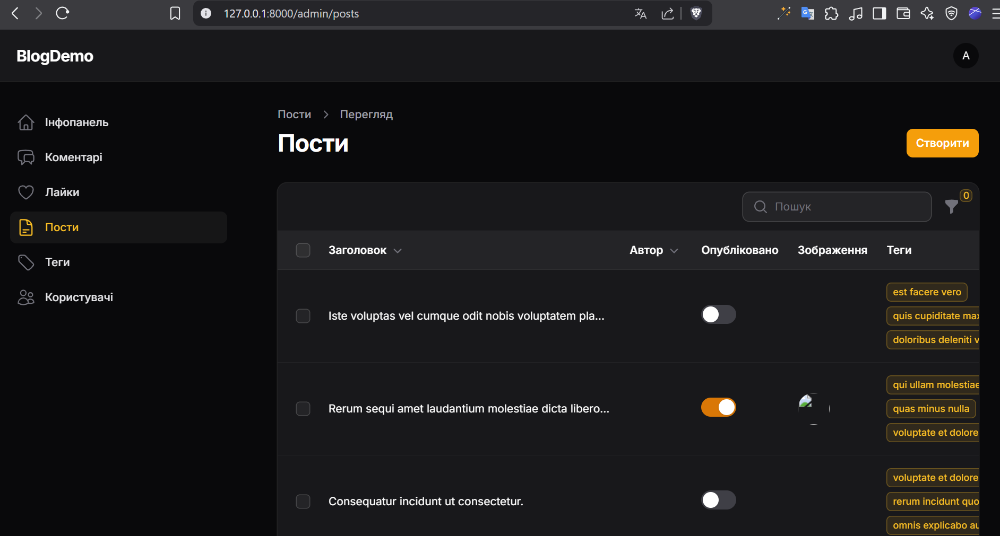

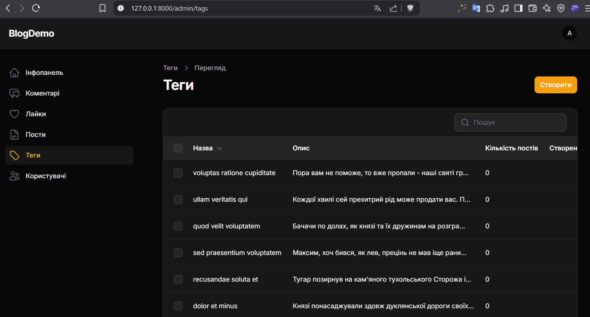

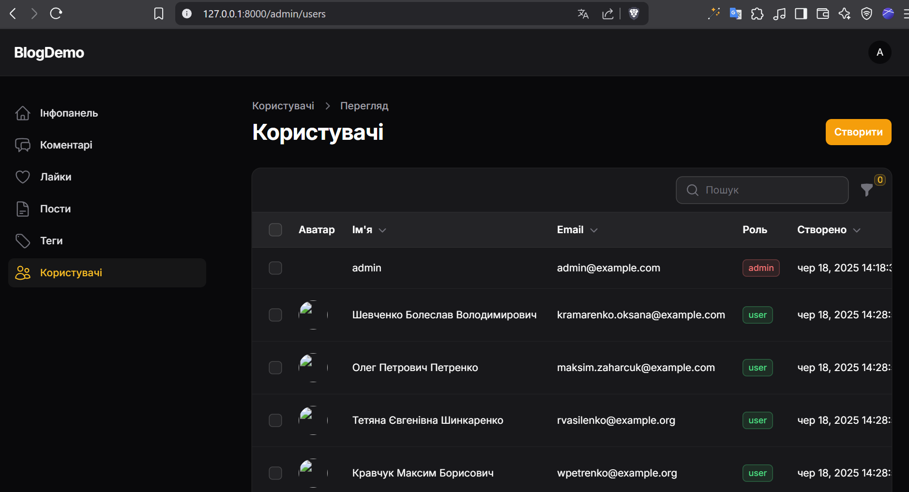