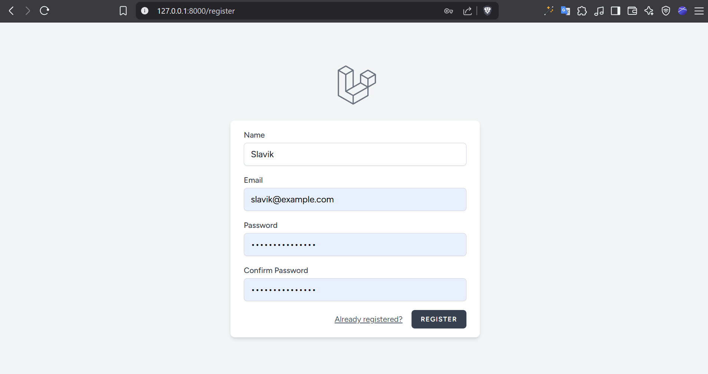
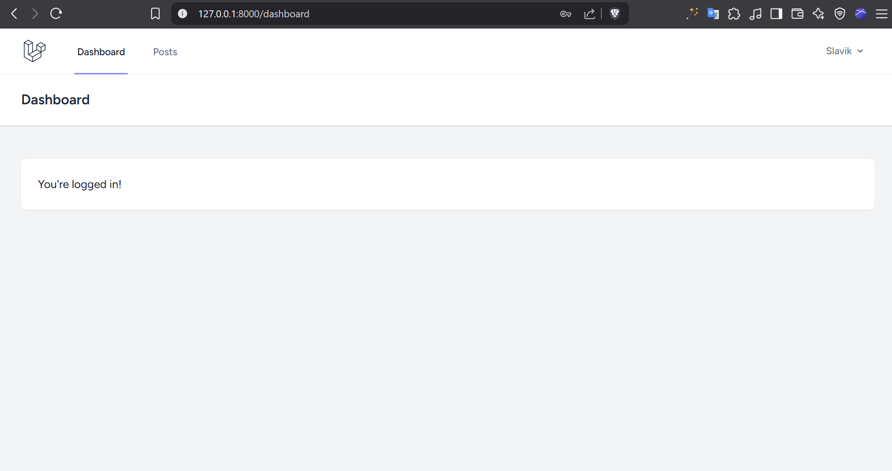
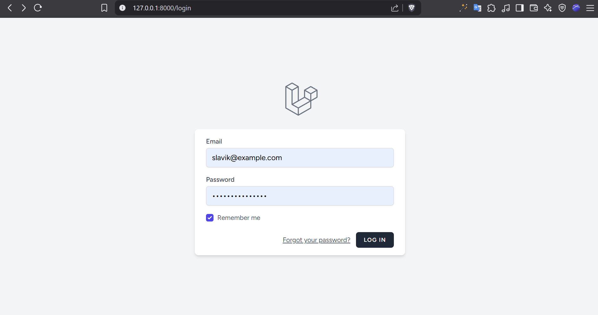

# Auth App

## Project Structure

* 📁 [app](./app)
  * 📁 [Http](./app/Http)
    * 📁 [Controllers](./app/Http/Controllers)
      * 📁 [Auth](./app/Http/Controllers/Auth)
        * 📄 [AuthenticatedSessionController.php](./app/Http/Controllers/Auth/AuthenticatedSessionController.php)
        * 📄 [ConfirmablePasswordController.php](./app/Http/Controllers/Auth/ConfirmablePasswordController.php)
        * 📄 [EmailVerificationNotificationController.php](./app/Http/Controllers/Auth/EmailVerificationNotificationController.php)
        * 📄 [EmailVerificationPromptController.php](./app/Http/Controllers/Auth/EmailVerificationPromptController.php)
        * 📄 [NewPasswordController.php](./app/Http/Controllers/Auth/NewPasswordController.php)
        * 📄 [PasswordController.php](./app/Http/Controllers/Auth/PasswordController.php)
        * 📄 [PasswordResetLinkController.php](./app/Http/Controllers/Auth/PasswordResetLinkController.php)
        * 📄 [RegisteredUserController.php](./app/Http/Controllers/Auth/RegisteredUserController.php)
        * 📄 [VerifyEmailController.php](./app/Http/Controllers/Auth/VerifyEmailController.php)
      * 📄 [Controller.php](./app/Http/Controllers/Controller.php)
      * 📄 [PostController.php](./app/Http/Controllers/PostController.php)
      * 📄 [ProfileController.php](./app/Http/Controllers/ProfileController.php)
    * 📁 [Requests](./app/Http/Requests)
      * 📁 [Auth](./app/Http/Requests/Auth)
        * 📄 [LoginRequest.php](./app/Http/Requests/Auth/LoginRequest.php)
      * 📄 [ProfileUpdateRequest.php](./app/Http/Requests/ProfileUpdateRequest.php)
  * 📁 [Models](./app/Models)
    * 📄 [Post.php](./app/Models/Post.php)
    * 📄 [User.php](./app/Models/User.php)
  * 📁 [Policies](./app/Policies)
    * 📄 [PostPolicy.php](./app/Policies/PostPolicy.php)
  * 📁 [Providers](./app/Providers)
    * 📄 [AppServiceProvider.php](./app/Providers/AppServiceProvider.php)
    * 📄 [AuthServiceProvider.php](./app/Providers/AuthServiceProvider.php)
  * 📁 [View](./app/View)
    * 📁 [Components](./app/View/Components)
      * 📄 [AppLayout.php](./app/View/Components/AppLayout.php)
      * 📄 [GuestLayout.php](./app/View/Components/GuestLayout.php)
* 📁 [bootstrap](./bootstrap)
* 📁 [config](./config)
* 📁 [database](./database)
  * 📁 [factories](./database/factories)
    * 📄 [UserFactory.php](./database/factories/UserFactory.php)
  * 📁 [migrations](./database/migrations)
    * 📄 [0001_01_01_000000_create_users_table.php](./database/migrations/0001_01_01_000000_create_users_table.php)
    * 📄 [0001_01_01_000001_create_cache_table.php](./database/migrations/0001_01_01_000001_create_cache_table.php)
    * 📄 [0001_01_01_000002_create_jobs_table.php](./database/migrations/0001_01_01_000002_create_jobs_table.php)
    * 📄 [2025_06_18_123556_create_posts_table.php](./database/migrations/2025_06_18_123556_create_posts_table.php)
  * 📁 [seeders](./database/seeders)
    * 📄 [DatabaseSeeder.php](./database/seeders/DatabaseSeeder.php)
    * 📄 [PostSeeder.php](./database/seeders/PostSeeder.php)
* 📁 [public](./public)
  * 📄 [index.php](./public/index.php)
* 📁 [resources](./resources)
  * 📁 [css](./resources/css)
    * 📄 [app.css](./resources/css/app.css)
  * 📁 [js](./resources/js)
    * 📄 [app.js](./resources/js/app.js)
    * 📄 [bootstrap.js](./resources/js/bootstrap.js)
  * 📁 [views](./resources/views)
    * 📁 [auth](./resources/views/auth)
      * 📄 [confirm-password.blade.php](./resources/views/auth/confirm-password.blade.php)
      * 📄 [forgot-password.blade.php](./resources/views/auth/forgot-password.blade.php)
      * 📄 [login.blade.php](./resources/views/auth/login.blade.php)
      * 📄 [register.blade.php](./resources/views/auth/register.blade.php)
      * 📄 [reset-password.blade.php](./resources/views/auth/reset-password.blade.php)
      * 📄 [verify-email.blade.php](./resources/views/auth/verify-email.blade.php)
    * 📁 [components](./resources/views/components)
      * 📄 [application-logo.blade.php](./resources/views/components/application-logo.blade.php)
      * 📄 [auth-session-status.blade.php](./resources/views/components/auth-session-status.blade.php)
      * 📄 [danger-button.blade.php](./resources/views/components/danger-button.blade.php)
      * 📄 [dropdown-link.blade.php](./resources/views/components/dropdown-link.blade.php)
      * 📄 [dropdown.blade.php](./resources/views/components/dropdown.blade.php)
      * 📄 [input-error.blade.php](./resources/views/components/input-error.blade.php)
      * 📄 [input-label.blade.php](./resources/views/components/input-label.blade.php)
      * 📄 [modal.blade.php](./resources/views/components/modal.blade.php)
      * 📄 [nav-link.blade.php](./resources/views/components/nav-link.blade.php)
      * 📄 [primary-button.blade.php](./resources/views/components/primary-button.blade.php)
      * 📄 [responsive-nav-link.blade.php](./resources/views/components/responsive-nav-link.blade.php)
      * 📄 [secondary-button.blade.php](./resources/views/components/secondary-button.blade.php)
      * 📄 [text-input.blade.php](./resources/views/components/text-input.blade.php)
    * 📁 [layouts](./resources/views/layouts)
      * 📄 [app.blade.php](./resources/views/layouts/app.blade.php)
      * 📄 [guest.blade.php](./resources/views/layouts/guest.blade.php)
      * 📄 [navigation.blade.php](./resources/views/layouts/navigation.blade.php)
    * 📁 [posts](./resources/views/posts)
      * 📄 [create.blade.php](./resources/views/posts/create.blade.php)
      * 📄 [edit.blade.php](./resources/views/posts/edit.blade.php)
      * 📄 [index.blade.php](./resources/views/posts/index.blade.php)
      * 📄 [show.blade.php](./resources/views/posts/show.blade.php)
    * 📁 [profile](./resources/views/profile)
      * 📁 [partials](./resources/views/profile/partials)
        * 📄 [delete-user-form.blade.php](./resources/views/profile/partials/delete-user-form.blade.php)
        * 📄 [update-password-form.blade.php](./resources/views/profile/partials/update-password-form.blade.php)
        * 📄 [update-profile-information-form.blade.php](./resources/views/profile/partials/update-profile-information-form.blade.php)
      * 📄 [edit.blade.php](./resources/views/profile/edit.blade.php)
    * 📄 [dashboard.blade.php](./resources/views/dashboard.blade.php)
    * 📄 [welcome.blade.php](./resources/views/welcome.blade.php)
* 📁 [routes](./routes)
  * 📄 [auth.php](./routes/auth.php)
  * 📄 [console.php](./routes/console.php)
  * 📄 [web.php](./routes/web.php)
* 📁 [screenshots](./screenshots)
* 📄 [composer.json](./composer.json)
* 📄 [package.json](./package.json)
* 📄 [postcss.config.js](./postcss.config.js)
* 📄 [tailwind.config.js](./tailwind.config.js)
## Screenshots

