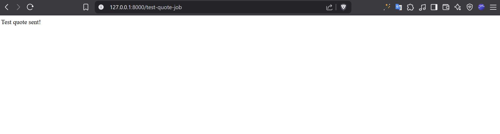
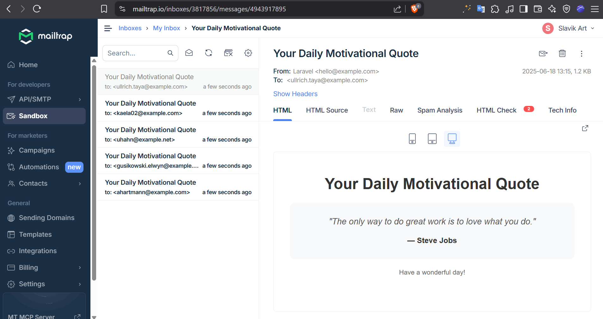

# Quotes App

## Project Structure

* 📁 [app](./app)
  * 📁 [Http](./app/Http)
    * 📁 [Controllers](./app/Http/Controllers)
      * 📄 [Controller.php](./app/Http/Controllers/Controller.php)
  * 📁 [Jobs](./app/Jobs)
    * 📄 [SendDailyQuote.php](./app/Jobs/SendDailyQuote.php)
  * 📁 [Mail](./app/Mail)
    * 📄 [DailyQuote.php](./app/Mail/DailyQuote.php)
  * 📁 [Models](./app/Models)
    * 📄 [User.php](./app/Models/User.php)
  * 📁 [Providers](./app/Providers)
    * 📄 [AppServiceProvider.php](./app/Providers/AppServiceProvider.php)
* 📁 [bootstrap](./bootstrap)
* 📁 [config](./config)
* 📁 [database](./database)
  * 📁 [factories](./database/factories)
    * 📄 [UserFactory.php](./database/factories/UserFactory.php)
  * 📁 [migrations](./database/migrations)
    * 📄 [0001_01_01_000000_create_users_table.php](./database/migrations/0001_01_01_000000_create_users_table.php)
    * 📄 [0001_01_01_000001_create_cache_table.php](./database/migrations/0001_01_01_000001_create_cache_table.php)
    * 📄 [0001_01_01_000002_create_jobs_table.php](./database/migrations/0001_01_01_000002_create_jobs_table.php)
  * 📁 [seeders](./database/seeders)
    * 📄 [DatabaseSeeder.php](./database/seeders/DatabaseSeeder.php)
* 📁 [public](./public)
  * 📄 [index.php](./public/index.php)
* 📁 [resources](./resources)
  * 📁 [css](./resources/css)
    * 📄 [app.css](./resources/css/app.css)
  * 📁 [js](./resources/js)
    * 📄 [app.js](./resources/js/app.js)
    * 📄 [bootstrap.js](./resources/js/bootstrap.js)
  * 📁 [views](./resources/views)
    * 📁 [emails](./resources/views/emails)
      * 📄 [daily-quote.blade.php](./resources/views/emails/daily-quote.blade.php)
    * 📄 [welcome.blade.php](./resources/views/welcome.blade.php)
* 📁 [routes](./routes)
  * 📄 [console.php](./routes/console.php)
  * 📄 [web.php](./routes/web.php)
* 📁 [screenshots](./screenshots)
* 📄 [composer.json](./composer.json)
* 📄 [package.json](./package.json)
## Screenshots

