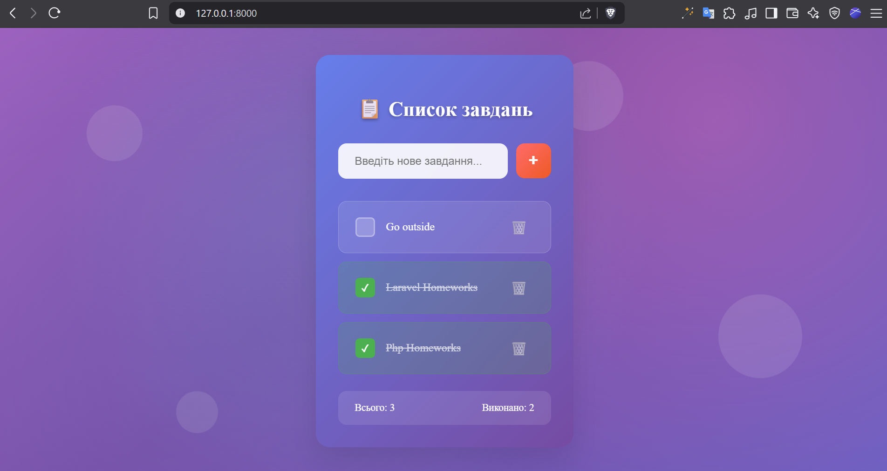
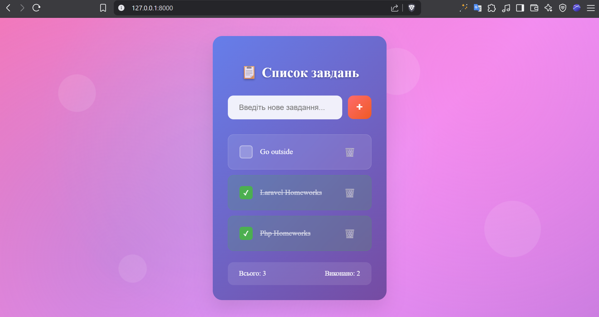

# Task List App

## Project Structure

* 📁 [app](./app)
  * 📁 [Http](./app/Http)
    * 📁 [Controllers](./app/Http/Controllers)
      * 📁 [Auth](./app/Http/Controllers/Auth)
        * 📄 [VerifyEmailController.php](./app/Http/Controllers/Auth/VerifyEmailController.php)
      * 📄 [Controller.php](./app/Http/Controllers/Controller.php)
  * 📁 [Livewire](./app/Livewire)
    * 📁 [Actions](./app/Livewire/Actions)
      * 📄 [Logout.php](./app/Livewire/Actions/Logout.php)
    * 📄 [TaskManager.php](./app/Livewire/TaskManager.php)
  * 📁 [Models](./app/Models)
    * 📄 [Task.php](./app/Models/Task.php)
    * 📄 [User.php](./app/Models/User.php)
  * 📁 [Providers](./app/Providers)
    * 📄 [AppServiceProvider.php](./app/Providers/AppServiceProvider.php)
    * 📄 [VoltServiceProvider.php](./app/Providers/VoltServiceProvider.php)
* 📁 [bootstrap](./bootstrap)
* 📁 [config](./config)
* 📁 [database](./database)
  * 📁 [factories](./database/factories)
    * 📄 [UserFactory.php](./database/factories/UserFactory.php)
  * 📁 [migrations](./database/migrations)
    * 📄 [0001_01_01_000000_create_users_table.php](./database/migrations/0001_01_01_000000_create_users_table.php)
    * 📄 [0001_01_01_000001_create_cache_table.php](./database/migrations/0001_01_01_000001_create_cache_table.php)
    * 📄 [0001_01_01_000002_create_jobs_table.php](./database/migrations/0001_01_01_000002_create_jobs_table.php)
    * 📄 [2025_06_18_142249_create_tasks_table.php](./database/migrations/2025_06_18_142249_create_tasks_table.php)
  * 📁 [seeders](./database/seeders)
    * 📄 [DatabaseSeeder.php](./database/seeders/DatabaseSeeder.php)
* 📁 [public](./public)
  * 📄 [apple-touch-icon.png](./public/apple-touch-icon.png)
  * 📄 [favicon.svg](./public/favicon.svg)
  * 📄 [index.php](./public/index.php)
* 📁 [resources](./resources)
  * 📁 [css](./resources/css)
    * 📄 [app.css](./resources/css/app.css)
  * 📁 [js](./resources/js)
    * 📄 [app.js](./resources/js/app.js)
  * 📁 [views](./resources/views)
    * 📁 [components](./resources/views/components)
      * 📁 [layouts](./resources/views/components/layouts)
        * 📁 [app](./resources/views/components/layouts/app)
          * 📄 [header.blade.php](./resources/views/components/layouts/app/header.blade.php)
          * 📄 [sidebar.blade.php](./resources/views/components/layouts/app/sidebar.blade.php)
        * 📁 [auth](./resources/views/components/layouts/auth)
          * 📄 [card.blade.php](./resources/views/components/layouts/auth/card.blade.php)
          * 📄 [simple.blade.php](./resources/views/components/layouts/auth/simple.blade.php)
          * 📄 [split.blade.php](./resources/views/components/layouts/auth/split.blade.php)
        * 📄 [app.blade.php](./resources/views/components/layouts/app.blade.php)
        * 📄 [auth.blade.php](./resources/views/components/layouts/auth.blade.php)
      * 📁 [settings](./resources/views/components/settings)
        * 📄 [layout.blade.php](./resources/views/components/settings/layout.blade.php)
      * 📄 [action-message.blade.php](./resources/views/components/action-message.blade.php)
      * 📄 [app-logo-icon.blade.php](./resources/views/components/app-logo-icon.blade.php)
      * 📄 [app-logo.blade.php](./resources/views/components/app-logo.blade.php)
      * 📄 [auth-header.blade.php](./resources/views/components/auth-header.blade.php)
      * 📄 [auth-session-status.blade.php](./resources/views/components/auth-session-status.blade.php)
      * 📄 [placeholder-pattern.blade.php](./resources/views/components/placeholder-pattern.blade.php)
    * 📁 [flux](./resources/views/flux)
      * 📁 [icon](./resources/views/flux/icon)
        * 📄 [book-open-text.blade.php](./resources/views/flux/icon/book-open-text.blade.php)
        * 📄 [chevrons-up-down.blade.php](./resources/views/flux/icon/chevrons-up-down.blade.php)
        * 📄 [folder-git-2.blade.php](./resources/views/flux/icon/folder-git-2.blade.php)
        * 📄 [layout-grid.blade.php](./resources/views/flux/icon/layout-grid.blade.php)
      * 📁 [navlist](./resources/views/flux/navlist)
        * 📄 [group.blade.php](./resources/views/flux/navlist/group.blade.php)
    * 📁 [livewire](./resources/views/livewire)
      * 📁 [auth](./resources/views/livewire/auth)
        * 📄 [confirm-password.blade.php](./resources/views/livewire/auth/confirm-password.blade.php)
        * 📄 [forgot-password.blade.php](./resources/views/livewire/auth/forgot-password.blade.php)
        * 📄 [login.blade.php](./resources/views/livewire/auth/login.blade.php)
        * 📄 [register.blade.php](./resources/views/livewire/auth/register.blade.php)
        * 📄 [reset-password.blade.php](./resources/views/livewire/auth/reset-password.blade.php)
        * 📄 [verify-email.blade.php](./resources/views/livewire/auth/verify-email.blade.php)
      * 📁 [settings](./resources/views/livewire/settings)
        * 📄 [appearance.blade.php](./resources/views/livewire/settings/appearance.blade.php)
        * 📄 [delete-user-form.blade.php](./resources/views/livewire/settings/delete-user-form.blade.php)
        * 📄 [password.blade.php](./resources/views/livewire/settings/password.blade.php)
        * 📄 [profile.blade.php](./resources/views/livewire/settings/profile.blade.php)
      * 📄 [task-manager.blade.php](./resources/views/livewire/task-manager.blade.php)
    * 📁 [partials](./resources/views/partials)
      * 📄 [head.blade.php](./resources/views/partials/head.blade.php)
      * 📄 [settings-heading.blade.php](./resources/views/partials/settings-heading.blade.php)
    * 📄 [dashboard.blade.php](./resources/views/dashboard.blade.php)
    * 📄 [welcome.blade.php](./resources/views/welcome.blade.php)
* 📁 [routes](./routes)
  * 📄 [auth.php](./routes/auth.php)
  * 📄 [console.php](./routes/console.php)
  * 📄 [web.php](./routes/web.php)
* 📁 [screenshots](./screenshots)
* 📄 [composer.json](./composer.json)
* 📄 [package.json](./package.json)
## Screenshots

